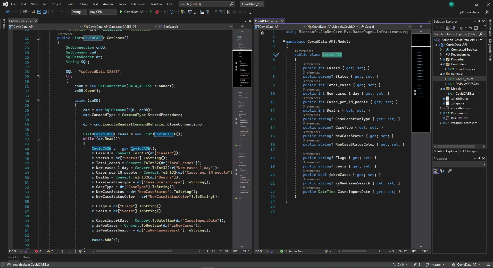
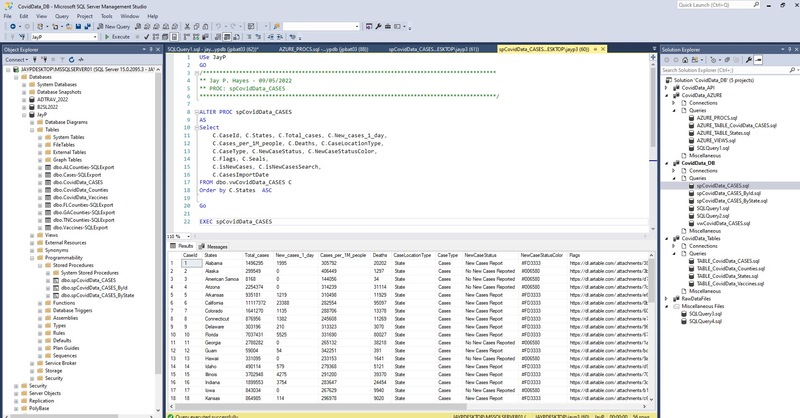

## Keysys C# API sample project ( Version 2022.09.06)


# Next.js / React.js / Tailwinds Front end

Next.js is an open-source web development framework created by Vercel enabling React-based web applications with server-side rendering and generating static websites

React is a free and open-source front-end JavaScript library for building user interfaces based on UI components. It is maintained by Meta and a community of individual developers and companies.

# Keysys C# API sample project.

ASP.NET Core is a free and open-source web framework and successor to ASP.NET, developed by Microsoft. It is a modular framework that runs on both the full .NET Framework, on Windows, and the cross-platform .NET. However ASP.NET Core version 3 works only on .NET Core dropping support of the .NET Framewor


# Sql Server Database

Microsoft SQL Server is a relational database management system developed by Microsoft. As a database server, it is a software product with the primary function of storing and retrieving data as requested by other software applications—which may run either on the same computer or on another computer across a network


# Next.js + Tailwind CSS Example

This example shows how to use [Tailwind CSS](https://tailwindcss.com/) [(v3.0)](https://tailwindcss.com/blog/tailwindcss-v3) with Next.js. It follows the steps outlined in the official [Tailwind docs](https://tailwindcss.com/docs/guides/nextjs).

## Deploy your own

Deploy the example using [Vercel](https://vercel.com?utm_source=github&utm_medium=readme&utm_campaign=next-example) or preview live with [StackBlitz](https://stackblitz.com/github/vercel/next.js/tree/canary/examples/with-tailwindcss)

[](https://vercel.com/new/git/external?repository-url=https://github.com/vercel/next.js/tree/canary/examples/with-tailwindcss&project-name=with-tailwindcss&repository-name=with-tailwindcss)

## How to use

Execute [`create-next-app`](https://github.com/vercel/next.js/tree/canary/packages/create-next-app) with [npm](https://docs.npmjs.com/cli/init), [Yarn](https://yarnpkg.com/lang/en/docs/cli/create/), or [pnpm](https://pnpm.io) to bootstrap the example:

```bash
npx create-next-app --example with-tailwindcss with-tailwindcss-app
```

```bash
yarn create next-app --example with-tailwindcss with-tailwindcss-app
```

```bash
pnpm create next-app --example with-tailwindcss with-tailwindcss-app
```

Deploy it to the cloud with [Vercel](https://vercel.com/new?utm_source=github&utm_medium=readme&utm_campaign=next-example) ([Documentation](https://nextjs.org/docs/deployment)).
